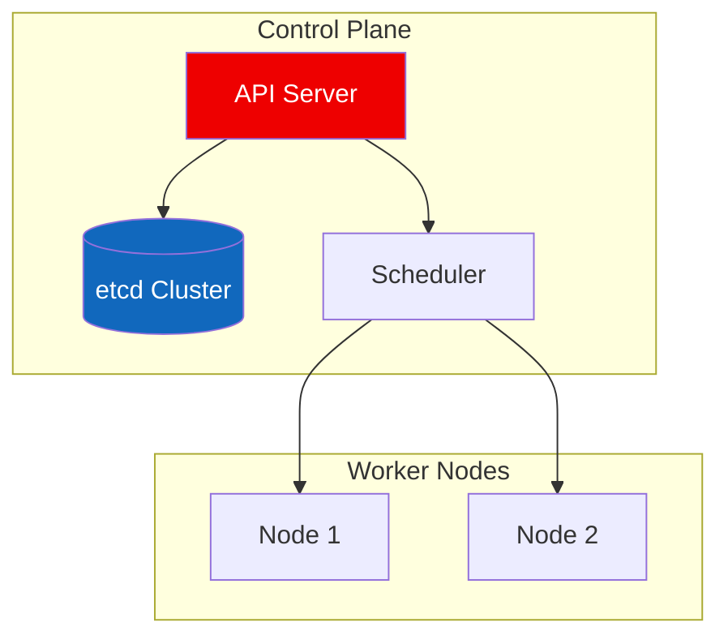
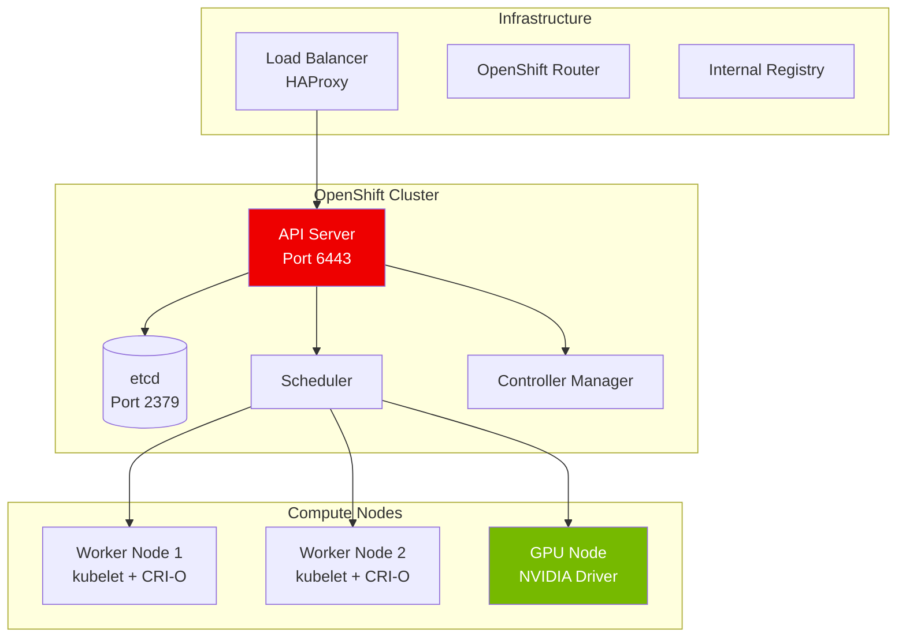
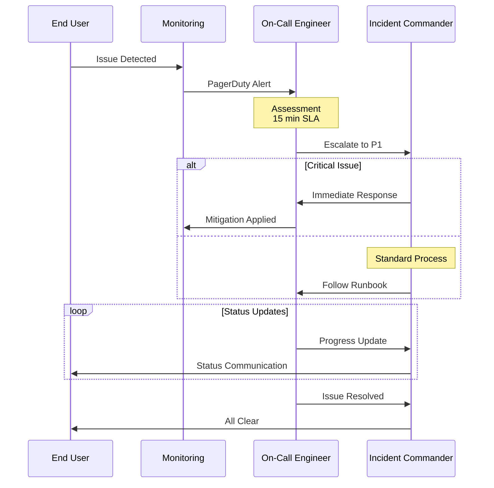
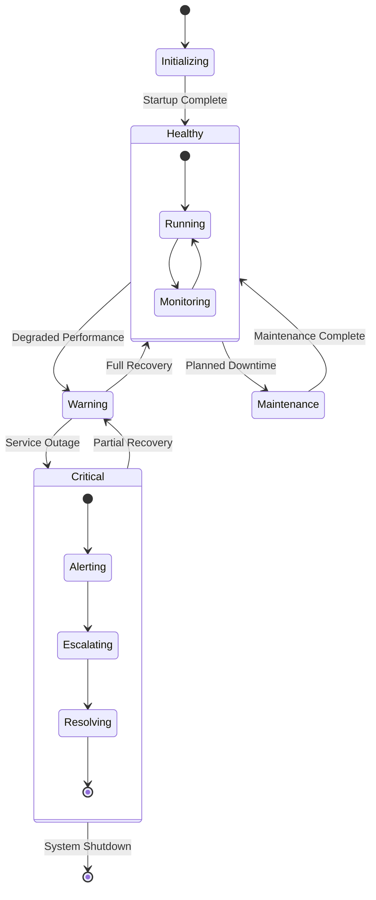
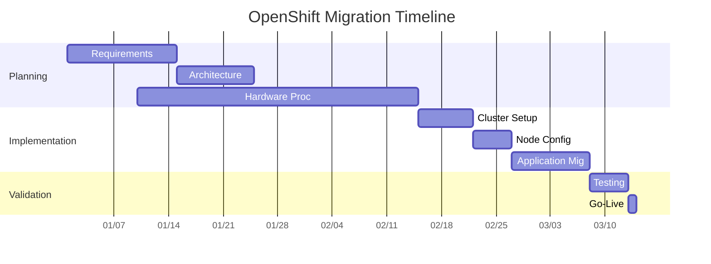
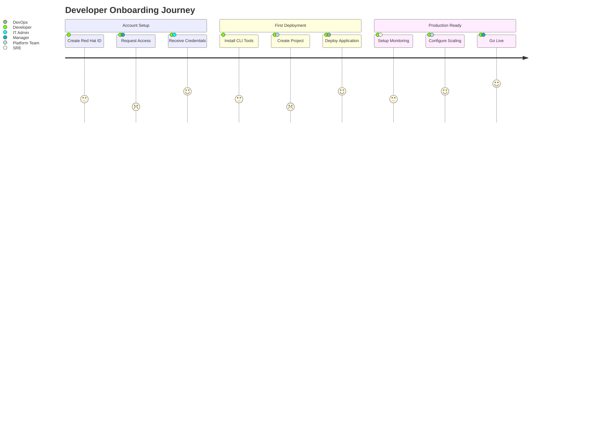
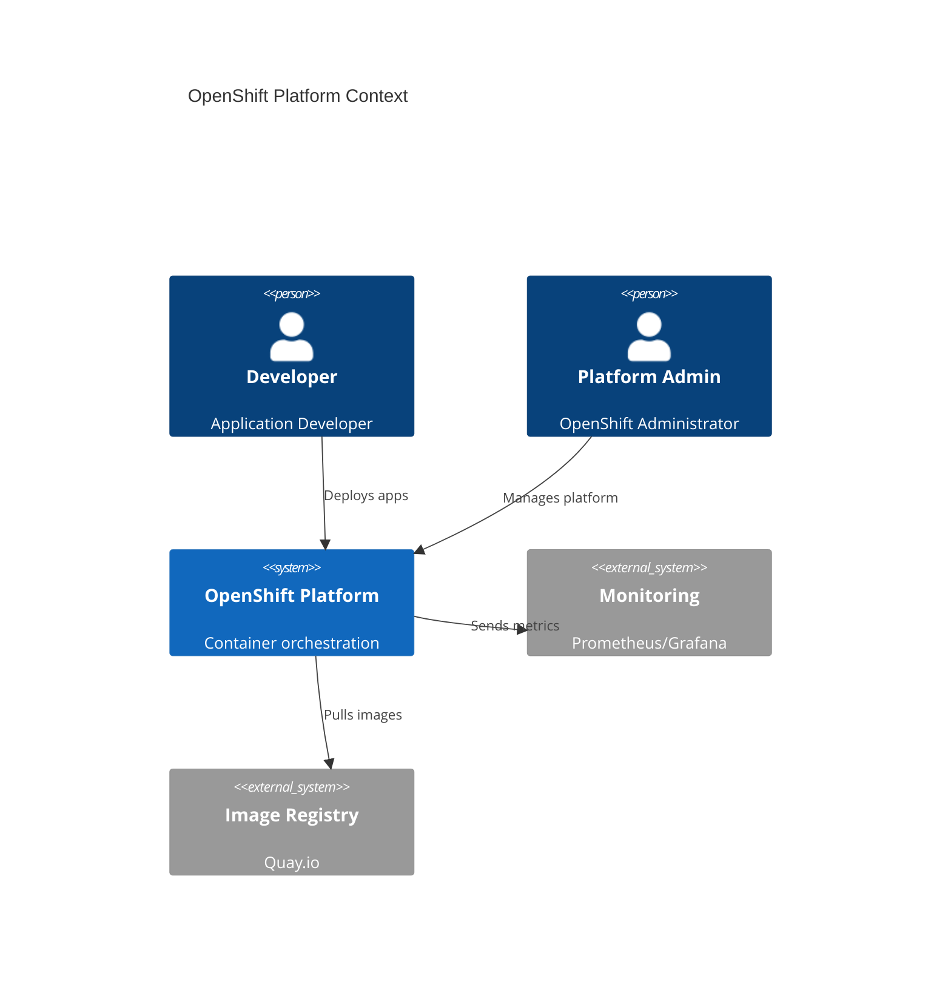
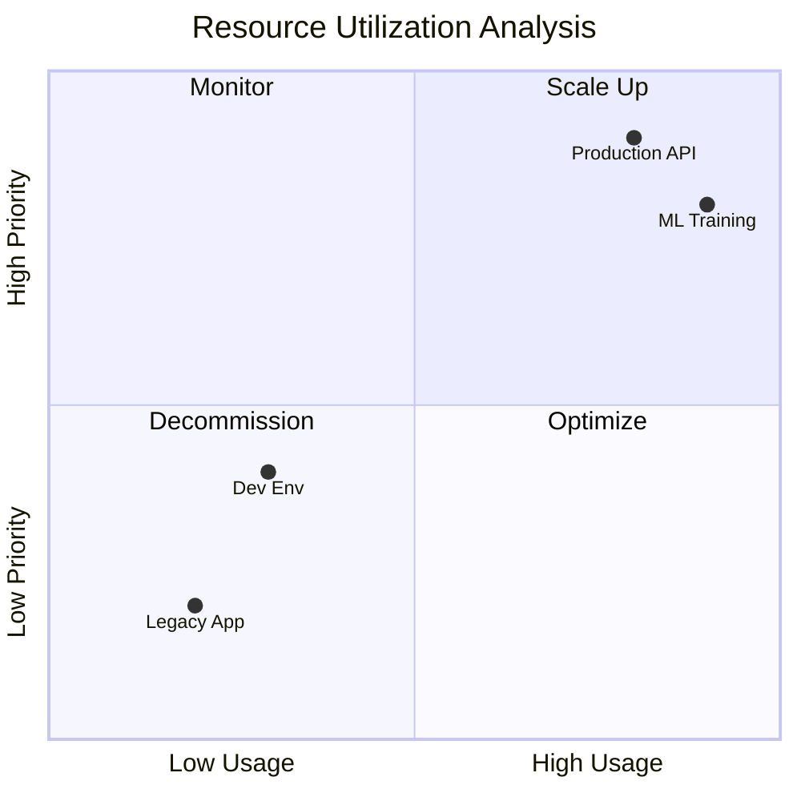

# Mermaid Syntax Validation Guide for Platform Administration

This guide provides **correct syntax patterns** and **common pitfalls** for Mermaid diagrams used in OpenShift platform documentation.

## 🧪 **Quick Validation Method**

Test each diagram individually before adding to documents:

```bash
# Test single diagram
echo 'graph TD; A-->B;' > test.mmd && mmdc -i test.mmd -o test.png

# Test from file
mmdc -i your-diagram.mmd -o validation.png
```

---

## 1. **Flowcharts** - Architecture & Process Flows

### ✅ **Correct Syntax**



### ❌ **Common Mistakes**

```mermaid
# WRONG: Missing direction
graph
    A --> B

# WRONG: Invalid subgraph syntax
subgraph Control Plane  # Missing quotes
    API[API Server]

# WRONG: Invalid style syntax
style API fill:red      # Missing quotes and #
```

### 🎯 **OpenShift Examples**



---

## 2. **Sequence Diagrams** - Incident Response & API Flows

### ✅ **Correct Syntax**



### ❌ **Common Mistakes**

```mermaid
# WRONG: Text after else
else Critical Issue        # Should be just "else"

# WRONG: Missing participant declaration
User->>Monitor: Message    # User not declared

# WRONG: Invalid arrow syntax
User-->Monitor: Message    # Should be ->> for sequence

# WRONG: Break outside alt/loop
break                      # Must be inside alt block
```

### 🎯 **Key Sequence Rules**

1. **Participants**: Always declare at the top
2. **Arrows**: Use `->>` for messages, `-->>` for responses
3. **Alt blocks**: `else` is standalone, no text
4. **Notes**: `Note over` or `Note left of` / `Note right of`
5. **Loops**: Must have proper `end`
6. **Break**: Only inside `alt` blocks

---

## 3. **State Diagrams** - System Status & Workflows

### ✅ **Correct Syntax**



### ❌ **Common Mistakes**

```mermaid
# WRONG: Using old state syntax
state A {
    state B
}
# Should use stateDiagram-v2

# WRONG: Missing arrow
Healthy Warning            # Should be: Healthy --> Warning

# WRONG: Invalid nested state
state Healthy
    Running --> Monitoring # Should be inside state block
```

---

## 4. **Gantt Charts** - Project Timelines

### ✅ **Correct Syntax**



### ❌ **Common Mistakes**

```mermaid
# WRONG: Missing dateFormat
gantt
    title Project Timeline  # Missing dateFormat YYYY-MM-DD

# WRONG: Invalid date dependency
Task1 :after task2, 5d     # Should be: Task1 :task1, after task2, 5d

# WRONG: Missing section
Task1 :task1, 2024-01-01, 5d  # Should be under a section
```

---

## 5. **Journey Maps** - User/Process Flows

### ✅ **Correct Syntax**



### ❌ **Common Mistakes**

```mermaid
# WRONG: Missing score
Create Account: Developer              # Missing score (1-5)

# WRONG: Invalid section syntax
section: Account Setup                 # Should be: section Account Setup

# WRONG: Invalid actor format
Create Account: 3: Developer Manager   # Should be: 3: Developer, Manager
```

---

## 6. **C4 Context/Container Diagrams** - Architecture

### ✅ **Correct Syntax**



### ❌ **Common Mistakes**

```mermaid
# WRONG: Missing C4Context declaration
Person(dev, "Developer")              # Should start with C4Context

# WRONG: Invalid relationship syntax
Rel(dev, openshift)                   # Missing description

# WRONG: Wrong element type
SystemExt(monitoring, "External")     # Should be System_Ext
```

---

## 7. **Git Graphs** - Release & Branching

### ✅ **Correct Syntax**

```mermaid
gitgraph
    commit id: "Initial"
    branch develop
    checkout develop
    commit id: "Add user authentication"
    commit id: "Implement data validation"
    
    checkout main
    branch hotfix
    checkout hotfix
    commit id: "Critical Fix"
    
    checkout main
    merge hotfix
    tag: "v1.0.1"
    
    checkout develop
    merge main
    commit id: "Feature 3"
    
    checkout main
    merge develop
    tag: "v1.1.0"
```

### ❌ **Common Mistakes**

```mermaid
# WRONG: Invalid branch syntax
branch: develop                       # Should be: branch develop

# WRONG: Merge without checkout
merge develop                         # Should checkout target first

# WRONG: Invalid tag syntax
tag "v1.0"                           # Should be: tag: "v1.0"
```

---

## 8. **Quadrant Charts** - Analysis & Planning

### ✅ **Correct Syntax**



### ❌ **Common Mistakes**

```mermaid
# WRONG: Missing axis labels
quadrantChart
    title Analysis               # Missing x-axis and y-axis

# WRONG: Invalid quadrant syntax
quadrant1 Scale Up              # Should be: quadrant-1 Scale Up

# WRONG: Invalid data point format
"Production": 0.8, 0.9          # Should be: "Production": [0.8, 0.9]
```

---

## 🚀 **Testing Your Diagrams**

### **Individual Testing Script**

```bash
#!/bin/bash
# test-diagram.sh

echo "Testing diagram syntax..."

# Create test file
cat > test-diagram.mmd << 'EOF'
# Paste your diagram here
EOF

# Test with mmdc
if mmdc -i test-diagram.mmd -o test-output.png; then
    echo "✅ Diagram syntax is valid!"
    echo "📁 Output: test-output.png"
else
    echo "❌ Syntax error detected!"
    echo "🔧 Check the error message above"
fi

# Cleanup
rm -f test-diagram.mmd test-output.png
```

### **Batch Testing All Diagrams**

```bash
# Extract and test all diagrams from markdown
grep -n '```mermaid' your-doc.md | while read line; do
    line_num=$(echo $line | cut -d: -f1)
    echo "Testing diagram at line $line_num..."
    
    # Extract diagram content and test
    # (Implementation would extract between ```mermaid and ```)
done
```

---

## 🎯 **Platform Admin Quick Reference**

### **Most Common Diagram Types:**

1. **Flowcharts**: Architecture, process flows, troubleshooting
2. **Sequence**: Incident response, API interactions, deployments  
3. **State**: System health, deployment states, workflow status
4. **Gantt**: Migration timelines, maintenance windows, projects
5. **Journey**: User onboarding, developer experience, workflows

### **Validation Checklist:**

- [ ] Proper diagram type declaration
- [ ] All elements properly defined
- [ ] Correct arrow syntax for diagram type
- [ ] Valid color codes (hex with #)
- [ ] Proper subgraph/section syntax
- [ ] No trailing spaces or special characters
- [ ] Consistent indentation
- [ ] All blocks properly closed (end statements)

### **Quick Syntax Test:**

```bash
# Add this to your workflow
./convert.sh --test-only your-document.md
# (This would run syntax validation without full conversion)
```

Now you have a comprehensive syntax guide to create bulletproof Mermaid diagrams for your OpenShift documentation! 🎯

🦅🦅🦅 